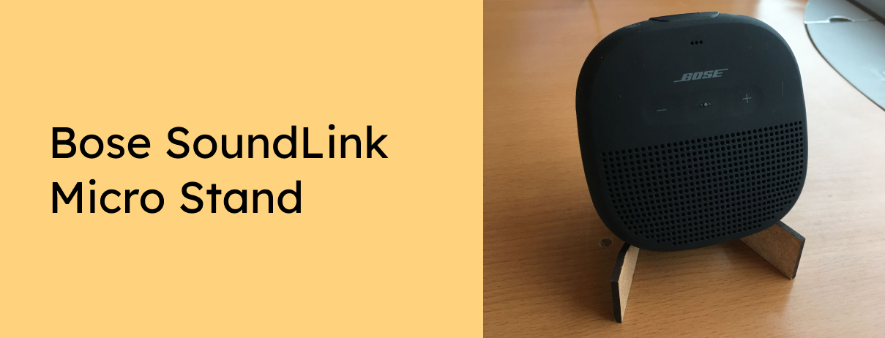

Do you have a Bose SoundLink Micro Stand or another portable Bluetooth speaker? Lasercut this stand to improve the orientation of the speaker - for a better sound experience.

Want to support the development and stay updated?

 

## Instrutions
Lasercut the bose_soundlink_stand.svg two times on 3mm thick MDF plates - and connect the two parts using two small pieces of cable binder.